# Valheim Auto Waypoints

BepInEx mod for [Valheim](https://www.valheimgame.com/) that automatically
puts pins on your map for useful things you walk past - ore veins, berry
bushes, mushrooms, crops, herbs, beehives, dungeon entrances, world
structures and ruins, portals and ships - each with a fitting icon and name.
Everything is controlled from an in-game settings window on the map.

> **Unofficial mod.** This is a fan-made mod, not affiliated with or endorsed by
> Iron Gate. It marks your game as modded (the game shows this in the main menu),
> as Iron Gate asks mod authors to do.

## Screenshots

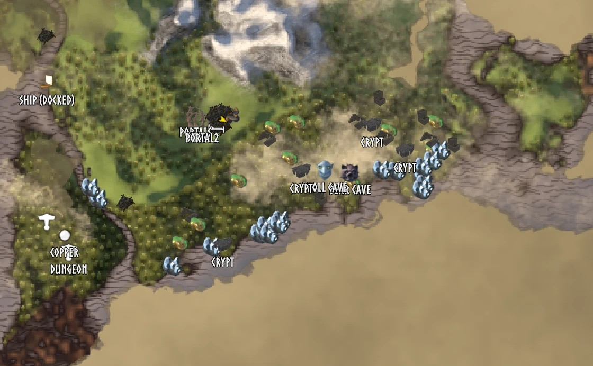

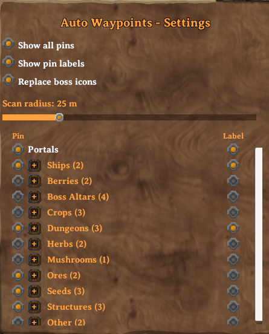

## What gets pinned

Anything in the scan radius around you (25 m by default). Places - dungeons,
camps, villages, ruins and the like - are pinned when you are within 40 m of
their centre, since large ones are much wider than the scan radius:

| Group | Pins (icon as shown on the map) | Notes |
|---|---|---|
| **Ores** | 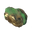 Copper Ore · 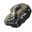 Silver Ore · 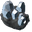 Tin Ore · 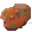 Iron Deposit · 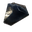 Obsidian · 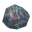 Meteorite · 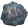 Flametal Deposit | Also untouched deposits you haven't hit with a pickaxe yet; the pin goes when the vein is mined out. Meteorites and the flametal deposits in the Ashlands lava drop the same ore, so they share its icon |
| **Berries** | 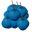 Blueberries · 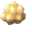 Cloudberries · 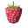 Raspberries ·  Lingonberries · 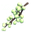 Vineberries | The pin stays after picking - bushes and vines regrow |
| **Mushrooms** | 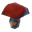 Mushroom · 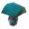 Blue Mushroom · 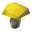 Yellow Mushroom ·  Jotun Puffs · 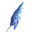 Magecap · 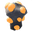 Smoke Puff |  |
| **Herbs** | 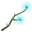 Thistle · 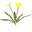 Dandelion · 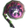 Fiddlehead |  |
| **Crops** | 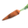 Carrot · 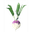 Turnip · 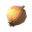 Onion ·  Kale · 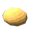 Poteitr · 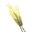 Wild Barley · 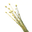 Wild Flax | Anything grown and ready to pick, wild or planted |
| **Seeds** | 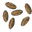 Carrot Seeds · 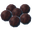 Turnip Seeds · 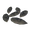 Onion Seeds · 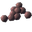 Kale Seeds | Wild seed plants - the only source before you start farming |
| **Beehives** | 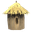 Beehive (built) · 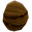 Wild beehive | Your own hives and wild ones (the tree hives that drop the queen bee) |
| **Dungeons** | 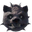 Bear Cave · 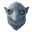 Troll Cave ·  Burial Chambers · 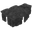 Sunken Crypt ·  Frost Cave · 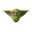 Fuling Camp · 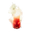 Surtling · 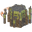 Infested Mine · 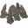 Winding Tunnels · 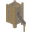 Morkhalla · 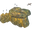 Smouldering Tomb · 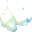 Howling Cavern · 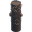 Sealed Tower | Each kind has its own switch |
| **Boss altars** | 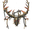 Eikthyr's Altar · 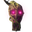 Elder's Altar · 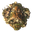 Bonemass' Altar · 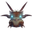 Moder's Altar · 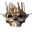 Yagluth's Altar · 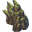 Infested Citadel ·  Fader's Altar ·  Deep North Boss | Trophy icons or renders with **Replace boss icons** on; otherwise the game's boss icon  |
| **Structures** |  Ruins ·  Log Cabin ·  Wood House ·  Draugr Village ·  Abandoned Farm ·  Swamp Hut ·  Stone Tower Ruins ·  Shipwreck ·  Stone Circle ·  Well ·  Dolmen ·  Runestone ·  Infested Tree ·  Sacrificial Stones ·  Combat Ruin ·  Stone Ship ·  Greydwarf Camp ·  Big Rock Clearing ·  Draugr Grave ·  Swamp Ruin ·  Swamp Well ·  Dragon Nest ·  Mountain Grave ·  Waymarker ·  Ancient Upgrade Station ·  Fuling Tower ·  Fuling Hut ·  Tar Pit | Loose ruins made of generic building pieces count too; anything a player built is never tagged |
| **Mistlands** |  Harbour ·  Viaduct ·  Statues ·  Giant Remains ·  Giant Armor ·  Dvergr Tower ·  Dvergr Excavation ·  Road Post |  |
| **Ashlands** |  Charred Fortress ·  Fortress Ruins ·  Ashland Ruins ·  Charred Ruins ·  Charred Tower Ruins ·  Dvergr Tower Ruins ·  Place of Mystery ·  Charred Stones ·  Sulfur Arch ·  Volture Nest | Charred Tower Ruins come in three shapes, each with its own icon |
| **Deep North** |  North Village ·  Frozen Ship ·  Lumber Camp ·  Northern Hut ·  Petrified Gammeltroll ·  Ice Pond ·  North Memorial |  |
| **Portals** |  Portal | Labelled with just the portal's name |
| **Ships** |  Ship / Ship (docked) | A live pin that follows a ship while someone sails it, and a docked pin where it was left |
| **Other** |  Trader ·  Hildir's Camp ·  Bog Witch Camp ·  Dragon Egg | Traders use this mod's icons with **Replace location icons** on. The dragon egg pin goes when someone picks the egg up |

Pins use the matching item or building icon, the trophy of whoever lives there
for caves, camps and boss altars (coins for the trader), or a custom icon
rendered from the game's own 3D model for structures, crypts and wild beehives. A pin is removed when its resource is gone (vein mined out, crop
picked); berry bushes keep their pin since they regrow. A pin you delete by
hand comes back the next time you pass by - to get rid of a whole kind of
pin, switch it off in the settings instead.

The mod keeps collecting even while a kind of pin (or everything) is hidden:
what you walk past goes straight into the hidden set and shows up as soon as
you switch it back on.

## Settings window

Open the large map and click **Waypoint Settings** (bottom-right, under the
map). Press Esc once to close the window, twice to also close the map.

- **Show all pins** - hide or show every pin this mod added
- **Show pin labels** - hide or show the names under this mod's pins
- **Replace boss icons** (off by default) - boss pins, including the ones the
  game adds when you read a Vegvisir runestone, get the boss trophy icon
  instead of the game's standard boss icon
- **Replace location icons** (off by default) - the icons the game itself
  shows for traders (Haldor, Hildir, the Bog Witch) and the sacrificial stones
  at the start use this mod's icons instead of the game's. Where the mod already
  has a named pin for such a place, the game's icon steps aside
- **Scan radius** - 5 to 100 m
- A list of categories in collapsible groups (Ores, Berries, Structures...),
  with two columns: **Pin** hides/shows the pins, **Label** hides/shows just
  their names. Each group header toggles the whole group.

Boss pins the game adds from Vegvisir runestones follow the switches of their
boss altar too - hiding them only makes them invisible, it never deletes them
from your map. Where the game already has a boss pin, the mod doesn't add a
second one.

Hiding never deletes anything: hidden pins are remembered per world and
character, and come back when you turn them on again, even after restarting
the game.

**Per character:** map pins belong to a character, so everything tied to them
is kept separately for each character - hidden pins and discovered categories
per world, and the settings window (pin and label switches, **Show all pins**,
**Show pin labels**, **Replace boss icons**, **Replace location icons**) per
character. The scan radius is shared. A character that has no settings yet
starts from the values in the config file.

**No spoilers:** a category only shows up in the list once the mod has
actually pinned one of its kind in that world, so a new player doesn't learn
from the settings that silver exists before finding any. If a whole group is
hidden, newly discovered kinds of that group start hidden too.

Your own pins are never touched.

Works together with
[Nav Compass](https://github.com/Ab5oluteZer0/valheim-nav-compass): a tracked
pin's name on the compass follows the label settings here. Other mods can ask
the same thing through the public `AutoWaypointsPlugin.IsPinLabelVisible(pin)`.

**Upgrading from 0.1.0:** the single "Dungeon" switch is replaced by one per
dungeon kind (its old setting carries over), and portal pins named
"Portal: name" are renamed to just "name" the first time you load a world.

**Upgrading from 1.0.3:** hidden pins, discovered categories and settings used
to be shared by all characters. The first character that enters a world after
the update takes over that world's data (the old files are kept as
`*.migrated`); every character starts from the current settings. Some names
changed - "Crypt" is now "Burial Chambers", "Barley"/"Flax" are "Wild
Barley"/"Wild Flax", and "Farm Village" is split into "Draugr Village" and
"Abandoned Farm". Existing pins are renamed when the world loads (or, on a
server, when you pass by).

## Requirements

- Valheim (tested on 1.0.15)
- [BepInEx](https://valheim.thunderstore.io/package/denikson/BepInExPack_Valheim/) 5.4.x
- [Jotunn](https://valheim.thunderstore.io/package/ValheimModding/Jotunn/) (used for the game-styled settings window)

## Installation (players)

1. Install BepInEx and Jotunn (links above, or use
   [r2modman](https://valheim.thunderstore.io/package/ebkr/r2modman/)).
2. Download `AutoWaypoints.dll` from the
   [latest release](../../releases/latest).
3. Drop it into `<Valheim install folder>\BepInEx\plugins\AutoWaypoints\`.
4. Launch the game and walk around - pins appear as you go.

The config file `BepInEx\config\com.michal.valheim.autowaypoints.cfg` holds
the scan radius and the starting settings for new characters. Everything else
is kept in `BepInEx\config\AutoWaypoints\`, so updating the mod with a mod
manager doesn't wipe it:

- `settings_<character>.json` - the settings window, per character
- `hidden_pins_<world>_<character>.json`, `discovered_<world>_<character>.json`
- `portals_<world>.json` - portal positions, per world

## Building from source

Requires the [.NET 8 SDK](https://dotnet.microsoft.com/download) (or newer)
and a local Valheim install with BepInEx and Jotunn installed.

```bash
git clone https://github.com/Ab5oluteZer0/valheim-auto-waypoints.git
cd valheim-auto-waypoints
dotnet build -c Release -p:ValheimPath="C:\Path\To\Valheim"
```

If you don't pass `-p:ValheimPath`, the build looks for a `VALHEIM_PATH`
environment variable, then falls back to the default Steam location
(`C:\Program Files (x86)\Steam\steamapps\common\Valheim`). Jotunn is expected
in `BepInEx\plugins\ValheimModding-Jotunn\` (where r2modman puts it);
override with `-p:JotunnPath=...` if yours is elsewhere.

The build automatically copies the built DLL into
`<Valheim>\BepInEx\plugins\AutoWaypoints\` for quick in-game testing.

## Notes on how it works (and a few gotchas found along the way)

- `Minimap.RemovePin` really deletes a pin, and the game saves the map on
  its own schedule - so "hiding" a category keeps the removed pins in the
  mod's own per-world file and re-adds them when shown again.
- `JsonUtility` silently drops a `List<YourClass>` field in a plugin
  assembly (you get `{}` with no error). The save files only use lists of
  built-in types, and every save is read back and checked before it
  overwrites the previous file.
- The game re-enables a pin's name label from two places: `UpdatePins`
  (only when it decides something changed) and a coroutine one second after
  the label is created - which happens again every time the pin scrolls back
  into view. Fighting that with `SetActive(false)` always loses; labels are
  hidden with a `CanvasGroup` alpha instead, which the game never touches.
- Ore veins (`MineRock`/`MineRock5`) have colliders on oddly named child
  fragments, so they're matched by what they drop, not by object name.
- Scanning a large radius is spread over several frames, so a 100 m radius
  doesn't cause a hitch.
- Every location in the world (dungeon, camp, ruin, trader...) is spawned as a
  `LocationProxy` holding the location's name hash, with the visible model
  parented to it. Places assembled from rooms (Fuling camps, villages,
  fortresses) are different: their buildings are separate network objects, not
  under the proxy - so the mod keeps its own list of loaded proxies and checks
  them by distance instead of relying on what the scan happens to hit.
- Loose ruins (clusters of generic building pieces) are only pinned away from
  known locations: the walls of a Fuling tower or a village used to be picked
  up as extra "Ruins" pins on top of the location's own pin. Such leftover pins
  are removed when you pass by the location.
- Two map pins that look the same can be different places in the game data
  (e.g. three "Charred Tower Ruins" shapes); an icon can be set per location
  variant (`Icons/<category>__<location>.png`).

## Credits

Structure and dungeon icons are renders of Valheim's own 3D models.
Valheim and its assets are the property of Iron Gate AB.

## Support

All my mods are free and will stay free. If you enjoy them and want to say
thanks, you can leave a voluntary tip via [PayPal](https://www.paypal.com/ncp/payment/4JQUSHTJGBAG6) - it doesn't
unlock anything, it just helps me keep making mods.

## License

MIT - see [LICENSE](LICENSE). Applies to this mod's code, not to Valheim's
assets.
