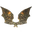

# Valheim Auto Waypoints

BepInEx mod for [Valheim](https://www.valheimgame.com/) that automatically
puts pins on your map for useful things you walk past - ore veins, berry
bushes, mushrooms, crops, herbs, beehives, dungeon entrances, world
structures and ruins, portals and ships - each with a fitting icon and name.
Everything is controlled from an in-game settings window on the map.

> **Unofficial mod.** This is a fan-made mod, not affiliated with or endorsed by
> Iron Gate. It marks your game as modded (the game shows this in the main menu),
> as Iron Gate asks mod authors to do.

## Screenshots


## What gets pinned

Anything in the scan radius around you (25 m by default):

| Group | Pins (icon as shown on the map) | Notes |
|---|---|---|
| **Ores** |  Copper Ore ·  Silver Ore ·  Tin Ore ·  Iron Deposit ·  Obsidian ·  Meteorite | Also untouched deposits you haven't hit with a pickaxe yet; the pin goes when the vein is mined out |
| **Berries** |  Blueberries ·  Cloudberries ·  Raspberries ·  Lingonberries | The pin stays after picking - bushes regrow |
| **Mushrooms** |  Mushroom ·  Blue Mushroom ·  Yellow Mushroom ·  Jotun Puffs ·  Magecap |  |
| **Herbs** |  Thistle ·  Dandelion |  |
| **Crops** |  Carrot ·  Turnip ·  Onion ·  Kale ·  Poteitr ·  Barley ·  Flax | Anything grown and ready to pick, wild or planted |
| **Seeds** |  Carrot Seeds ·  Turnip Seeds ·  Onion Seeds | Wild seed plants - the only source before you start farming |
| **Beehives** |  Beehive (built) ·  Wild beehive | Your own hives and wild ones (the tree hives that drop the queen bee) |
| **Dungeons** |  Bear Cave ·  Troll Cave ·  Crypt ·  Sunken Crypt ·  Frost Cave ·  Fuling Camp ·  Surtling | Each kind has its own switch |
| **Boss altars** |  Eikthyr's Altar ·  Elder's Altar ·  Bonemass' Altar ·  Moder's Altar ·  Yagluth's Altar | Trophy icons with **Replace boss icons** on; otherwise the game's boss icon  |
| **Structures** |  Ruins ·  Log Cabin ·  Wood House ·  Farm Village ·  Swamp Hut ·  Stone Tower Ruins ·  Harbour ·  Viaduct ·  Shipwreck ·  Stone Circle ·  Well ·  Dolmen ·  Runestone ·  Statues ·  Giant Remains ·  Giant Armor ·  Dvergr Tower ·  Infested Mine ·  Dvergr Excavation ·  Road Post ·  Infested Tree | Loose ruins made of generic building pieces count too; anything a player built is never tagged |
| **Portals** |  Portal | Labelled with just the portal's name |
| **Ships** |  Ship / Ship (docked) | A live pin that follows a ship while someone sails it, and a docked pin where it was left |
| **Other** |  Trader |  |

Pins use the matching item or building icon, the trophy of whoever lives there
for caves, camps and boss altars (coins for the trader), or a custom icon
rendered from the game's own 3D model for structures, crypts and wild beehives. A pin is removed when its resource is gone (vein mined out, crop
picked); berry bushes keep their pin since they regrow. A pin you delete by
hand comes back the next time you pass by - to get rid of a whole kind of
pin, switch it off in the settings instead.

The mod keeps collecting even while a kind of pin (or everything) is hidden:
what you walk past goes straight into the hidden set and shows up as soon as
you switch it back on.

## Settings window

Open the large map and click **Waypoint Settings** (bottom-right, under the
map). Press Esc once to close the window, twice to also close the map.

- **Show all pins** - hide or show every pin this mod added
- **Show pin labels** - hide or show the names under this mod's pins
- **Replace boss icons** (off by default) - boss pins, including the ones the
  game adds when you read a Vegvisir runestone, get the boss trophy icon
  instead of the game's standard boss icon
- **Scan radius** - 5 to 100 m
- A list of categories in collapsible groups (Ores, Berries, Structures...),
  with two columns: **Pin** hides/shows the pins, **Label** hides/shows just
  their names. Each group header toggles the whole group.

Boss pins the game adds from Vegvisir runestones follow the switches of their
boss altar too - hiding them only makes them invisible, it never deletes them
from your map. Where the game already has a boss pin, the mod doesn't add a
second one.

Hiding never deletes anything: hidden pins are remembered per world and come
back when you turn them on again, even after restarting the game.

**No spoilers:** a category only shows up in the list once the mod has
actually pinned one of its kind in that world, so a new player doesn't learn
from the settings that silver exists before finding any. If a whole group is
hidden, newly discovered kinds of that group start hidden too.

Your own pins are never touched.

Works together with
[Nav Compass](https://github.com/Ab5oluteZer0/valheim-nav-compass): a tracked
pin's name on the compass follows the label settings here. Other mods can ask
the same thing through the public `AutoWaypointsPlugin.IsPinLabelVisible(pin)`.

**Upgrading from 0.1.0:** the single "Dungeon" switch is replaced by one per
dungeon kind (its old setting carries over), and portal pins named
"Portal: name" are renamed to just "name" the first time you load a world.

## Requirements

- Valheim (tested on 1.0.15)
- [BepInEx](https://valheim.thunderstore.io/package/denikson/BepInExPack_Valheim/) 5.4.x
- [Jotunn](https://valheim.thunderstore.io/package/ValheimModding/Jotunn/) (used for the game-styled settings window)

## Installation (players)

1. Install BepInEx and Jotunn (links above, or use
   [r2modman](https://valheim.thunderstore.io/package/ebkr/r2modman/)).
2. Download `AutoWaypoints.dll` from the
   [latest release](../../releases/latest).
3. Drop it into `<Valheim install folder>\BepInEx\plugins\AutoWaypoints\`.
4. Launch the game and walk around - pins appear as you go.

Settings are stored in `BepInEx\config\com.michal.valheim.autowaypoints.cfg`.
Hidden pins, discovered categories and the list of portal pins are kept per
world in `BepInEx\config\AutoWaypoints\` (`hidden_pins_<world>.json`,
`discovered_<world>.json`, `portals_<world>.json`), so updating the mod with a
mod manager doesn't wipe them. Files from older versions (saved next to the
DLL) are copied over automatically.

## Building from source

Requires the [.NET 8 SDK](https://dotnet.microsoft.com/download) (or newer)
and a local Valheim install with BepInEx and Jotunn installed.

```bash
git clone https://github.com/Ab5oluteZer0/valheim-auto-waypoints.git
cd valheim-auto-waypoints
dotnet build -c Release -p:ValheimPath="C:\Path\To\Valheim"
```

If you don't pass `-p:ValheimPath`, the build looks for a `VALHEIM_PATH`
environment variable, then falls back to the default Steam location
(`C:\Program Files (x86)\Steam\steamapps\common\Valheim`). Jotunn is expected
in `BepInEx\plugins\ValheimModding-Jotunn\` (where r2modman puts it);
override with `-p:JotunnPath=...` if yours is elsewhere.

The build automatically copies the built DLL into
`<Valheim>\BepInEx\plugins\AutoWaypoints\` for quick in-game testing.

## Notes on how it works (and a few gotchas found along the way)

- `Minimap.RemovePin` really deletes a pin, and the game saves the map on
  its own schedule - so "hiding" a category keeps the removed pins in the
  mod's own per-world file and re-adds them when shown again.
- `JsonUtility` silently drops a `List<YourClass>` field in a plugin
  assembly (you get `{}` with no error). The save files only use lists of
  built-in types, and every save is read back and checked before it
  overwrites the previous file.
- The game re-enables a pin's name label from two places: `UpdatePins`
  (only when it decides something changed) and a coroutine one second after
  the label is created - which happens again every time the pin scrolls back
  into view. Fighting that with `SetActive(false)` always loses; labels are
  hidden with a `CanvasGroup` alpha instead, which the game never touches.
- Ore veins (`MineRock`/`MineRock5`) have colliders on oddly named child
  fragments, so they're matched by what they drop, not by object name.
- Scanning a large radius is spread over several frames, so a 100 m radius
  doesn't cause a hitch.

## Credits

Structure and dungeon icons are renders of Valheim's own 3D models.
Valheim and its assets are the property of Iron Gate AB.

## Support

All my mods are free and will stay free. If you enjoy them and want to say
thanks, you can leave a voluntary tip via [PayPal](https://www.paypal.com/ncp/payment/4JQUSHTJGBAG6) - it doesn't
unlock anything, it just helps me keep making mods.

## License

MIT - see [LICENSE](LICENSE). Applies to this mod's code, not to Valheim's
assets.
